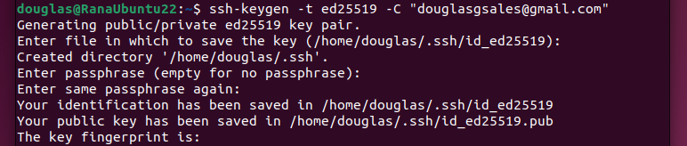
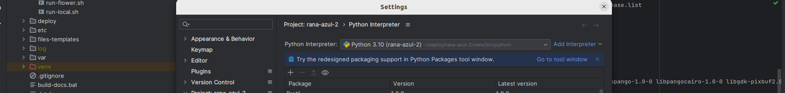
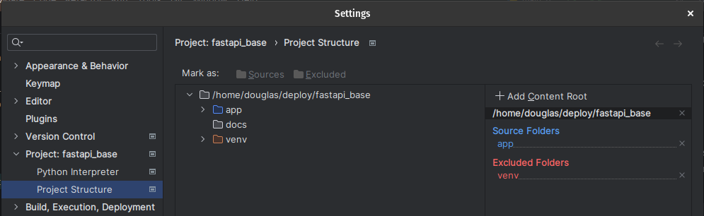

## Linux (Ubuntu/Pop OS) Development Environment Setup
### 1. Generate SSH Keys:

Open the terminal and type the following command:

```bash
ssh-keygen -t ed25519 -C "your_email@example.com"
```

Example:

### 2. Copy SSH KEY:

To get your ssh key to add in github, run the following command on the terminal:

```bash
cat ~/.ssh/id_ed25519.pub

```

Copy the entire output to the next steps. 

### 3. Add SSH KEY to Github

Open Github and Sign In to your account. Open the User Menu by clicking in the image in the right upper corner of the page, select the settings options, click on SSH and GPG keys, click on New SSH key and paste your ssh key to the input box. Click save.

### 4. Install Git

In the terminal, write the following command

```bash
sudo apt-get install git
```

### 5. Clone the Project

```bash
git clone <this_page.git>
```

### 6. Install Pycharm

Open the Software Store, look for Pycharm in the search bar. Install the Pycharm Community Edition.

or

Access https://www.jetbrains.com/pycharm/download/ and download the tar.gz file

A Installation guide is avaliable in:

https://www.jetbrains.com/help/pycharm/installation-guide.html#f92031a5


### 7. Install Docker
https://docs.docker.com/engine/install/

### (Optional) Run Docker without sudo

Open the Terminal and run the following commands

```bash
sudo groupadd docker
sudo usermod -aG docker $USER
newgrp docker
```

### 8. Configure Pycharm

Open Pycharm Menu, go to File>Settings

In the new Window, Go to Project: hopdesk-server>Python Interpreter. Click on the Select box and select the virtual environment for Python 3.10. Example:



If no option is shown, click on “Add Interpreter”, select Python3.10 and create the virtual environment.

If Python3.10 is not on the list, locate the installed binaries. Generally they can be found in:

- /usr/bin/
- /usr/local/bin

With the environment created, check in the shown list if the project dependencies are installed. If they are not, open the terminal on Pycharm, navigate to the code\ Folder and execute the following command:

```bash
pip3 install -r requirement-dev.txt
```

Go to  Project: <project_name>/Project Structure. Right click on the “app” folder and select “Sources”.



Close the Settings Window.

In the Right Corner of the IDE, click on the “Add configuration” Button.

Click on the “+” sign on the left side of the screen and select Python.


### 9. Set Environment Variables

In Pycharm, switch to the developent brach and update it.

In Pycharm, Navigate to the code/proj/ Folder

Find the Files: 

- .env.example

Copy those files and rename the copy to:

- .env

### (OPTIONAL) Edit the Environment Variables

In Pycharm, open the .env file to set the variables to your liking.

### (OPTIONAL) Apply backup to database

TODO
### Run Migrations

```bash
make migrate
```

### 10. Run the Project

In the terminal, inside the project folder, execute the following command to start the docker servers:

```bash
make db
```

This will run the project databases and some helper containers

With the containers running, start the project by clicking on the play button on the top right of the IDE or with the following command:
```bash
make dev
```


Finally, navigate to http://127.0.0.1:8000/ and start coding!


### Configure PGAdmin

Go to http://127.0.0.1:5050 <br/>
Enter email and password <br/>
admin@admin.com<br/>
admin

In the top left corner, click with the right mouse button and select Register > Server

In Name: localhost

In the Connection Tab:
host: postgres<br/>
username: 'your_username'<br/>
password: 'your_password'<br/>

click save


## Deploy (UBUNTU EC2)
1. install docker
2. connect to instance using your .pem key
```bash
 ssh -i "<path_to_key.pem>" ubuntu@<ec2_hostname>
```
2. generate ssh key
```bash
  ssh-keygen -t rsa -b 4096 -C "{email}"
```
3. Add Deploy key to github:
   (START AT STEP 2)
    https://docs.github.com/en/authentication/connecting-to-github-with-ssh/managing-deploy-keys#set-up-deploy-keys

4. Clone Project
```bash
  git clone <github_link> 
```
33. Create .env file in the project root folder
 ```bash
    cd <project_name>
    cp .env.exmplae .env
```
3. Edit the new .env file as required
```bash
    nano .env
```
4. deploy containers
```bash
  docker compose up -d --build
```
